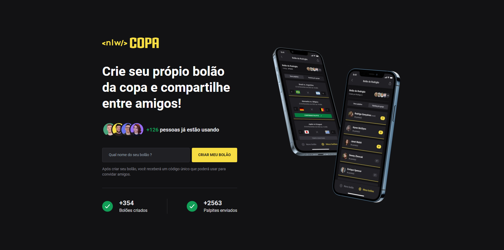

  

## 📃 Sobre

NLW Copa é o projeto desenvolvido durante a NLW(Next Level Week), um evento organizado pela Rocketseat.

## 💻 Projeto

Esse projeto consiste em uma aplicação com temática da copa, tem como objetivo o desenvolvimento de uma plataforma para que os usuários possam criar bolões e palpites para a copa do mundo de 2022. A aplicação WEB é uma interface simplificada, apenas com as informações, para que o usuário possa conhecer o projeto e criar os bolões.

## 📌 Tecnologias

- [Typescript](https://www.typescriptlang.org/docs/)
- [React](https://reactjs.org/)
- [NextJs](https://nextjs.org/)
- [Tailwind](https://tailwindcss.com/)
- [Axios](https://axios-http.com/)
